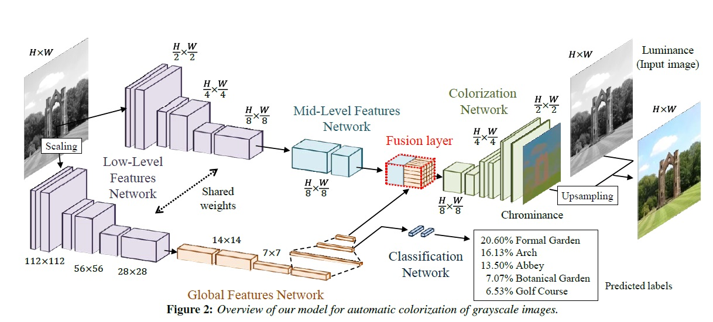

# colorNet-pytorch
A Neural Network For Automatic Image Colorization

This project is a PyTorch version of the [ColorNet](http://hi.cs.waseda.ac.jp/~iizuka/projects/colorization/en/) issued on SIGGRAPH 2016. Please check out the original website for the details.

## Overview
* Net model

* DataSet
[MIT Places205](http://places.csail.mit.edu/user/index.php)  
> Hint: For there are grayscale images in the dataset, so I write a script to remove these images

## Result

For this network is trained by landscape image database, it's work well for scenery pictures. So if you use this network to color  images of other types, maybe you can't get a satisfying output.

